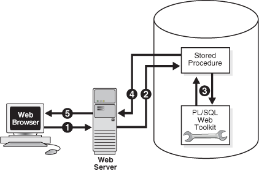
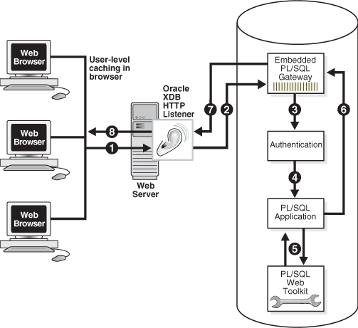
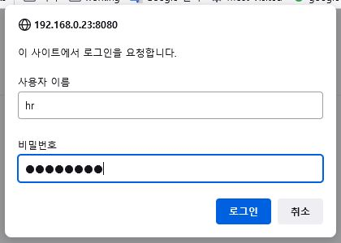
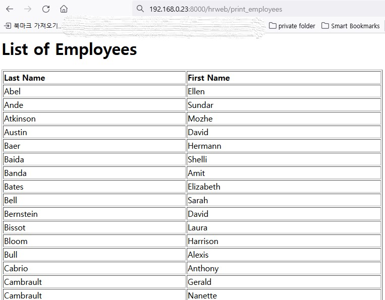

Embedded PLSQL WEB applicaton 예제
=======

참고자료  Oracle 19c Database Development Guide
https://docs.oracle.com/en/database/oracle/oracle-database/19/adfns/web-applications.html#GUID-B7C7170E-69AC-42D2-9597-451B1053209E

### PLSQL 웹 어플리케이션 서비스 구성 주요 컴포넌트들

* PLSQL 게이트웨이

  PLSQL 게이트웨이는 PLSQL 웹응용프로그램을 개발하고 배포하는 플랫폼으로써, PLSQL 게이트웨이를 사용하여 웹브라우저에서 HTTP 리스너를 통해 PLSQL 프로그램을 호출 할 수 있음.
   * mod_plsql PLSQL 게이트웨이
       * PLSQL 게이트웨이의 구현 방법중에 하나로써 오라클 HTTP Server 플러그인이며 웹 브라우저가 HTTP리스너를 통해 PL/SQL 프로그램을 호출할 수 있게 해줌.
       * 장점 : 동적 HTML 캐싱, 시스템 모니터링 및 로깅 지원, 웹-DB 사이의 방화벽 환경에서도 서비스가 가능
   * Embedded PLSQL 게이트웨이
       * DB 내장된 XML DB HTTP 리스너에서 실행되는 PLSQL 게이트웨이 임.
       * 별도의 외부 HTTP 리스너가 필요하지 않음.
       * DBMS_EPG 패키지를 사용하여 게이트웨이를 구성함.
       * 장점 : HTTP 서버 불필요, APEX와 통합 사용 가능(20.2 버전 부터는 미지원), PLSQL 웹 어플리케이션의 설치, 구성 및 관리 환경이 단순해짐

* PLSQL 웹 툴킷

  * PLSQL 웹 툴킷은 PLSQL 패키지 셋이며, 런타임 때 mod_plsql에 의해 호출된 PLSQL 웹 프로그램을 사용할 수 있게 해주는 인터페이스임
  * PLSQL 웹툴킷 API로 HTTP 요청에 대한 정보 얻기, 컨텐츠 타입 및 MIME 타입과 간은 HTTP 헤더 생성, 브라우저 쿠키 설정, HTML 페이지 생성 등이 가능함
     * 웹 툴킷 패키지들 : HTF, HTP, OWA_CACHE, OWA_COOKIE, OWA_CUSTOM, OWA_IMAGE, OWA_OPT_LOCK, OWA_PATTERN, OWA_SEC, OWA_TEXT, OWA_UTIL, WPG_DOCLOAD

  <p align="center">
  </img>
  </p>
  <p align="center">
  [mod_plsql 웹 어플리케이션 아키텍처]
  </p>
  <p align="center">
  </img>
  </p>
  <p align="center">
  [Embedded PLSQL 웹 어플리케이션 아키택처]
  </p>

<h2> 1. Embedded PLSQL 게이트웨이를 사용한 웹 어플리케이션 예제


### 필요한 주요 컴포넌트

* XML DB HTTP 리스너 : 오라클 XML DB의 일부분이며, 오라클 인스톨 될때 설치됨(별도 설치 불필요)
* PLSQL 웹 툴킷 : 오라클 표준 설치시 구성됨(별도 설치 불필요)

### XML DB HTTP 서버 구성

#### DISPATEHER 및 XDB HTTP 서비스 구성

아래와 같이 XDB HTTP 서버 데몬이 나오지 않으면 HTTP 데몬 설치를 아래와 같이 수행함.

```com
lsnrctl status|grep HTTP

(DESCRIPTION=(ADDRESS=(PROTOCOL=tcp)(HOST=wokot450.kr.oracle.com)(PORT=8000))(Presentation=HTTP)(Session=RAW))

```

```sql
SYS 계정으로 ([중요] PLSQL 게이트웨이를 서비스 할 PDB의 sys 계정으로 작업해야함)

conn sys/Welcome1@pdb1 as sysdba

show parameter dispatchers

NAME                                 TYPE        VALUE
------------------------------------ ----------- -----------------------------------------   
dispatchers                          string    (PROTOCOL=TCP)(SERVICE=wokoXDB)
max_dispatchers                      integer

select dbms_xdb_config.gethttpport from dual;

GETHTTPPORT
-----------
          0
-- XDB HTTP 서비스 포트 미개방 상태임

exec DBMS_XDB_CONFIG.setHTTPPort(8080);

ALTER SYSTEM REGISTER;

select dbms_xdb_config.gethttpport from dual;

GETHTTPPORT
-----------
       8080

```

listener.ora 파일 수정

```cmd
DISPATCHERS = "(PROTOCOL=TCP)(SERVICE=wokoXDB)"    -- 추가

lsnrctl stop

lsnrctl start
```

XDB HTTP 서버 데몬 확인
```cmd
lsnrctl status|grep HTTP

(DESCRIPTION=(ADDRESS=(PROTOCOL=tcp)(HOST=wokot450.kr.oracle.com)(PORT=8080))(Presentation=HTTP)(Session=RAW))

위와 같이 8080 port로 XDB HTTP 서비스가 올라오는 것을 확인해야 함.

* 주의 : 초기 세팅일 경우 service 데몬이 올라오는 시간이 다소 걸림. 여유를 가지고 기다림이 필요함.

lsnrctl service

LSNRCTL for Linux: Version 19.0.0.0.0 - Production on 23-MAR-2022 11:30:40

Copyright (c) 1991, 2021, Oracle.  All rights reserved.

Connecting to (DESCRIPTION=(ADDRESS=(PROTOCOL=TCP)(HOST=wokot450.kr.oracle.com)(PORT=1521)))
Services Summary...
Service "86b637b62fdf7a65e053f706e80a27ca.kr.oracle.com" has 1 instance(s).
  Instance "woko", status READY, has 1 handler(s) for this service...
    Handler(s):
      "DEDICATED" established:0 refused:0 state:ready
         LOCAL SERVER
Service "dad9e5ae6ee21817e0531700a8c02a14.kr.oracle.com" has 1 instance(s).
  Instance "woko", status READY, has 1 handler(s) for this service...
    Handler(s):
      "DEDICATED" established:0 refused:0 state:ready
         LOCAL SERVER
Service "dad9e68ee052193ce0531700a8c09cb8.kr.oracle.com" has 1 instance(s).
  Instance "woko", status READY, has 1 handler(s) for this service...
    Handler(s):
      "DEDICATED" established:0 refused:0 state:ready
         LOCAL SERVER
Service "pdb1.kr.oracle.com" has 1 instance(s).
  Instance "woko", status READY, has 1 handler(s) for this service...
    Handler(s):
      "DEDICATED" established:0 refused:0 state:ready
         LOCAL SERVER
Service "pdb2.kr.oracle.com" has 1 instance(s).
  Instance "woko", status READY, has 1 handler(s) for this service...
    Handler(s):
      "DEDICATED" established:0 refused:0 state:ready
         LOCAL SERVER
Service "woko.kr.oracle.com" has 1 instance(s).
  Instance "woko", status READY, has 1 handler(s) for this service...
    Handler(s):
      "DEDICATED" established:0 refused:0 state:ready
         LOCAL SERVER
Service "wokoXDB.kr.oracle.com" has 1 instance(s).
  Instance "woko", status READY, has 1 handler(s) for this service...
    Handler(s):
      "D000" established:0 refused:0 current:0 max:1022 state:ready
         DISPATCHER <machine: wokot450.kr.oracle.com, pid: 6133>
         (ADDRESS=(PROTOCOL=tcp)(HOST=wokot450.kr.oracle.com)(PORT=33071))
The command completed successfully

[oracle@wokot450 admin]$ lsnrctl status|grep HTTP
  (DESCRIPTION=(ADDRESS=(PROTOCOL=tcp)(HOST=wokot450.kr.oracle.com)(PORT=8080))(Presentation=HTTP)(Session=RAW))
```
#### 익명 DB계정 활성화
```sql
SYS 계정으로 로그인(PDB인 경우는 서비스 할 PDB의 SYS 계정임)

ALTER USER anonymous ACCOUNT UNLOCK;

col grantee format a30
SELECT * FROM DBA_ROLE_PRIVS WHERE GRANTED_ROLE = 'XDBADMIN';

GRANTEE                        GRANTED_ ADM DEL DEF COM INH
------------------------------ -------- --- --- --- --- ---
SYS                            XDBADMIN YES NO  YES YES YES
DBA                            XDBADMIN NO  NO  YES YES YES
GSMADMIN_ROLE                  XDBADMIN NO  NO  YES YES YES
```

### PLSQL 게이트웨이 구성

임베디드 게이트웨이는 오라클 XML DB 서블릿 관리 인터페이스를 통해 서블릿으로 관리됨.

관리 인터페이스는 DBMS_EPG 패키지이며, 이 패키지는 XML DB가 사용하는 xdbconfig.xml 파일을 수정함. 일반적으로 기본 구성값으로 사용하면 될 것임.

게이트웨이 구성 절차는 DAD 생성, DAD 세팅의 2단계로 수행됨.

구성 방식은 DB 인증 방식에 따라 정적(Static), 동적(Dynamic), 익명(Anonymous) 방식을 지원함. 어플레케이션 환경에 맞는 인증방식을 결정 후 인증 구성을 진행. 여기서는 동적 인증방식으로 수행됨.정적 및 익명 방식은 참고용임

#### 동적(Dynamic) 인증 구성 및 정보 확인

동적인증 방식은 DAD에 DB 계정명과 패스워드를 저장하지 않는 mod_plsql 을 지원하는 기능이며, 브라우저 사용자는 DAD로 액세스 할때 지정한 DB 계정명과 패스워드를 입력 요청 받게됨.

```sql
서비스할 PDB의 SYSTEM 계정으로 로그인 (이 작업은 XDBADMIN 롤이 필요함)

EXEC DBMS_EPG.CREATE_DAD('DYNAMIC_DAD', '/hrweb/*');

EXEC DBMS_EPG.SET_DAD_ATTRIBUTE('DYNAMIC_DAD', 'database-username', 'HR');

@$ORACLE_HOME/rdbms/admin/epgstat.sql  

+--------------------------------------+
| XDB protocol ports:                  |
|  XDB is listening for the protocol   |
|  when the protocol port is non-zero. |
+--------------------------------------+

HTTP Port FTP Port
--------- --------
     8080        0

1 row selected.

+---------------------------+
| DAD virtual-path mappings |
+---------------------------+

Virtual Path                     DAD Name
-------------------------------- --------------------------------
/hrweb/\*                         DYNAMIC_DAD

1 row selected.

+----------------+
| DAD attributes |
+----------------+

DAD Name     DAD Param                DAD Value
------------ ------------------------ ----------------------------------------
DYNAMIC_DAD  database-username        HR

1 row selected.

+---------------------------------------------------+
| DAD authorization:                                |
|  To use static authentication of a user in a DAD, |
|  the DAD must be authorized for the user.         |
+---------------------------------------------------+

no rows selected

+----------------------------+
| DAD authentication schemes |
+----------------------------+

DAD Name             User Name                        Auth Scheme
-------------------- -------------------------------- ------------------
DYNAMIC_DAD          HR                               Dynamic Restricted

1 row selected.

+--------------------------------------------------------+
| ANONYMOUS user status:                                 |
|  To use static or anonymous authentication in any DAD, |
|  the ANONYMOUS account must be unlocked.               |
+--------------------------------------------------------+

Database User   Status
--------------- --------------------
ANONYMOUS       EXPIRED

1 row selected.

+-------------------------------------------------------------------+
| ANONYMOUS access to XDB repository:                               |
|  To allow public access to XDB repository without authentication, |
|  ANONYMOUS access to the repository must be allowed.              |
+-------------------------------------------------------------------+

Allow repository anonymous access?
----------------------------------
false

1 row selected.

 ```

#### 정적(Static) 인증 구성
 정적인증 방식은 브라우저 사용자가 DB 인증 정보 입력할 필요 없도록 DAD에 DB사용자 계정명과 패스워드를 저장하는 방식임.

 ```sql
서비스할 PDB의 SYSTEM 계정으로 로그인 (이 작업은 XDBADMIN 롤이 필요함)

EXEC DBMS_EPG.CREATE_DAD('HR_DAD', '/plsql/*');
 -- '/plsql/*'은 가상 경로임

EXEC DBMS_EPG.SET_DAD_ATTRIBUTE('HR_DAD', 'database-username', 'HR');

GRANT EXECUTE ON DBMS_EPG TO HR;

EXEC DBMS_EPG.AUTHORIZE_DAD('HR_DAD', 'HR');
 또는
EXEC DBMS_EPG.AUTHORIZE_DAD('HR_DAD');
 -- exec DBMS_EPG.drop_dad('HR_DAD');

 ```

#### 익명(Anonymous) 인증 구성

익명(Anonymous)인증 방식은 DB 로그온을 위한 특별한 DAD 사용자를 지정하지 않는 방식임. DB 로그온을 위한 게이트웨이용 특정 DAD 계정을 만들고  서비스에 필요한 프로시저, 문서 테이블 객체들에 'PUBLIC' 액세스 권한을 부여하는 방식으로 구성하여 사용됨

```sql
서비스할 PDB의 SYSTEM 계정으로 로그인 (이 작업은 XDBADMIN 롤이 필요함)

EXEC DBMS_EPG.CREATE_DAD('HR_DAD', '/hrweb/*');
EXEC DBMS_EPG.SET_DAD_ATTRIBUTE('HR_DAD', 'database-username', 'ANONYMOUS');

```

### 샘플 프로시져 생성

```sql
HR 계정으로 로그인

CREATE OR REPLACE PROCEDURE print_employees IS
  CURSOR emp_cursor IS
    SELECT last_name, first_name
      FROM hr.employees
        ORDER BY last_name;
BEGIN
  HTP.PRINT('<html>');
  HTP.PRINT('<head>');
  HTP.PRINT('<meta http-equiv="Content-Type" content="text/html">');
  HTP.PRINT('<title>List of Employees</title>');
  HTP.PRINT('</head>');
  HTP.PRINT('<body TEXT="#000000" BGCOLOR="#FFFFFF">');
  HTP.PRINT('<h1>List of Employees</h1>');
  HTP.PRINT('<table width="40%" border="1">');
  HTP.PRINT('<tr>');
  HTP.PRINT('<th align="left">Last Name</th>');
  HTP.PRINT('<th align="left">First Name</th>');
  HTP.PRINT('</tr>');
  FOR emp_record IN emp_cursor LOOP
    HTP.PRINT('<tr>');
    HTP.PRINT('<td>' || emp_record.last_name  || '</td>');
    HTP.PRINT('<td>' || emp_record.first_name || '</td>');
  END LOOP;
  HTP.PRINT('</table>');
  HTP.PRINT('</body>');
  HTP.PRINT('</html>');
END;
/

```
### 웹 어플리케이션 서비스 확인

protocol://hostname[:port]/virt-path/[[!][schema.][package.]proc_name[?query_str]]

http://192.168.0.23:8000/hrweb/print_employees

사용자 ID : hr, 패스워드 입력


</img>


### 401 Unauthorized 경우 조치 방법

웹즈라우저에서 계정 및 패스워드를 입력했는데 401 Unauthorized 에러 메세지를 만났다면 아래와 같이 조치하세요.

```
서비스할 PDB의 SYS 계정으로 로그인

SET SERVEROUTPUT ON
DECLARE
 l_configxml XMLTYPE;
 l_value VARCHAR2(6) := 'basic'; -- (basic/digest)
BEGIN
 l_configxml := DBMS_XDB.cfg_get();
 IF l_configxml.existsNode('/xdbconfig/sysconfig/protocolconfig/httpconfig/authentication/allow-mechanism') = 0 THEN
  -- Element should not be missing
dbms_output.put_line (' allow-mechanism element is missing ');
 ELSE
  -- Update existing element.
  SELECT updateXML
  (
  DBMS_XDB.cfg_get(),
  '/xdbconfig/sysconfig/protocolconfig/httpconfig/authentication/allow-mechanism/text()',
  l_value,
  'xmlns="http://xmlns.oracle.com/xdb/xdbconfig.xsd"'
  )
  INTO l_configxml
  FROM dual;
  DBMS_OUTPUT.put_line('Element updated.');
 END IF;
 DBMS_XDB.cfg_update(l_configxml);
 DBMS_XDB.cfg_refresh;
END;
/
COMMIT;

```

http://192.168.0.23:8000/hrweb/print_employees

사용자 ID : hr, 패스워드 입력

</img>


수고하셨습니다~~


----------
